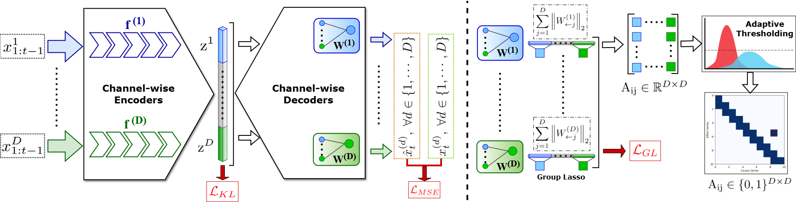
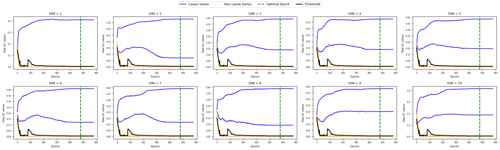
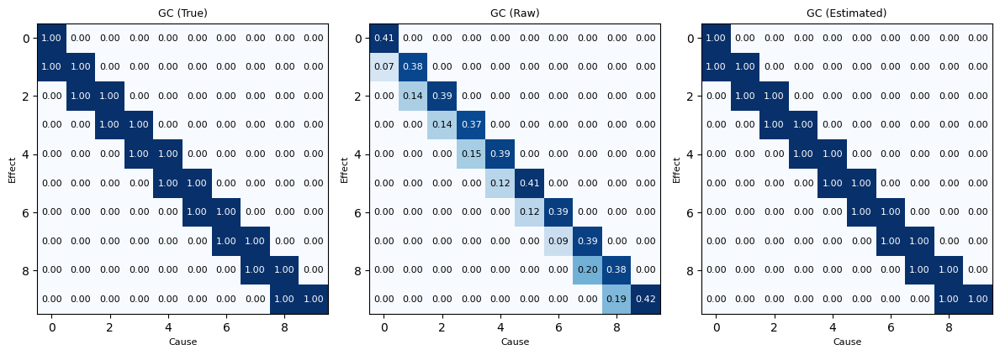

# CauFR-TS

<p align="center">
  <a href="https://github.com/ayan-cs/caufr-ts">
    
  </a>
  <a href="https://github.com/ayan-cs/caufr-ts">
    
  </a>
</p>

<p align="center">
  <b>Causal Time Series Identifiability via Factorized Representations</b>
  <br> <i>Under review at TMLR</i> 
</p>
<p align="center">
  
  
  
  
</p>

## 🥸 Overview

**CauFR-TS** is a neural framework for causal discovery in multivariate time series that explicitly enforces mechanism modularity at the representation level.

Unlike existing neural Granger causality methods that rely on shared latent encoders, CauFR-TS employs **dimension-wise factorized encoders**, preventing latent information leakage across variables. This design restores the conditional independence assumptions required for Granger causality and leads to **structurally identifiable causal graphs**.

In addition, CauFR-TS introduces a **data-driven, parameter-free adaptive thresholding** strategy based on Gaussian Mixture Models to robustly separate causal signals from noise.

---
## 🤓 Key Contributions
- **Factorized Encoder Architecture**  
  Each time series variable is encoded independently, eliminating latent confounding caused by shared representations.

- **Group-Sparse Decoder for Granger Causality**  
  Cross-variable dependencies are mediated exclusively through structured latent aggregation using group lasso regularization.

- **Adaptive, Data-Driven Thresholding**  
  A Gaussian Mixture Model is fit to decoder weight norms to automatically distinguish causal interactions from noise, avoiding heuristic cutoffs.

- **Strong Empirical Performance**  
  Consistent improvements over state-of-the-art baselines on synthetic chaotic systems and in silico biological benchmarks.

---
## 🧐 Methodology

<p align="center">  </p>

CauFR-TS models the conditional distribution $p(x_t|x_{1:t-1})$ using a factorized variational architecture:
**1.** Each variable is processed by an independent Transformer-based encoder.
**2.** Latent variables are reparameterized and concatenated into a structured latent vector.
**3.** Multi-head decoders predict future values using group-sparse weights.
**4.** Causal adjacency is recovered via adaptive probabilistic thresholding on decoder weights.

This architecture ensures that all inter-variable information flow is explicitly mediated by the learned causal matrix.

---
## 😵‍💫 Results & Visualizations

* 📈 **Training Dynamics:**
    - Evolution of group-lasso weights
    - Separation of causal vs non-causal mechanisms
    - Convergence of adaptive thresholds

<p align="center">  </p>

* 📊 **Causal Graph Recovery:**
    - (Left) Ground-truth causal adjacency matrix
    - (Middle) Estimated raw causal matrix obtained from the learned group-lasso decoder weights prior to thresholding
    - (Right) The final binary causal graph after applying the proposed adaptive thresholding procedure

<p align="center">  </p>

---
## 🤖 Execution

```
git clone git@github.com:ayan-cs/CauFR-TS.git
cd CauFR-TS
```

Make necessary changes based on your dataset. For a quick run on  H´enon maps,

```
python train.py
```

---

## 🗣️ Contact

Currently the paper is under anonymous submission at TMLR. We will update this once accepted.